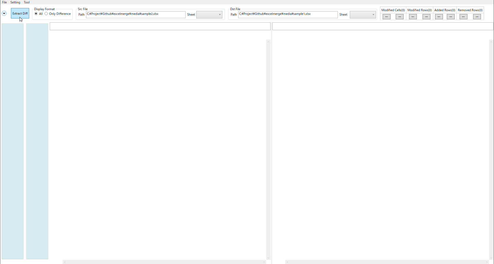
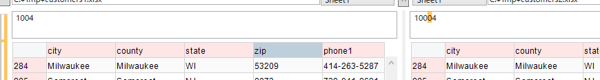
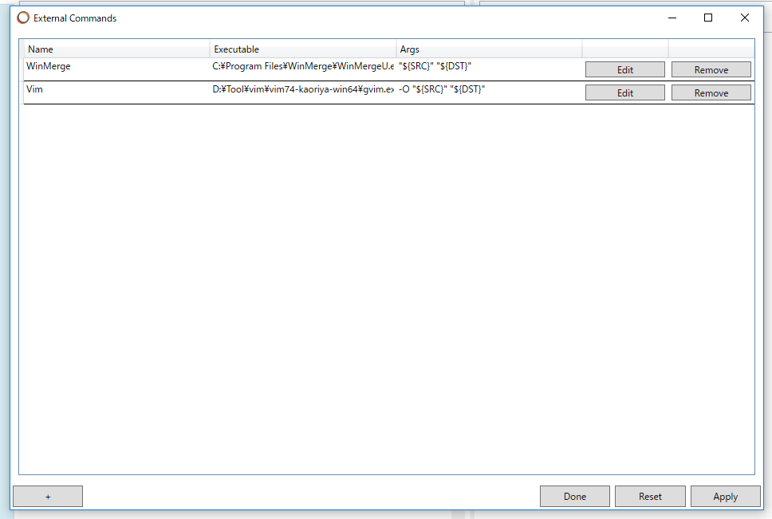
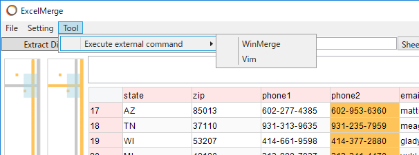
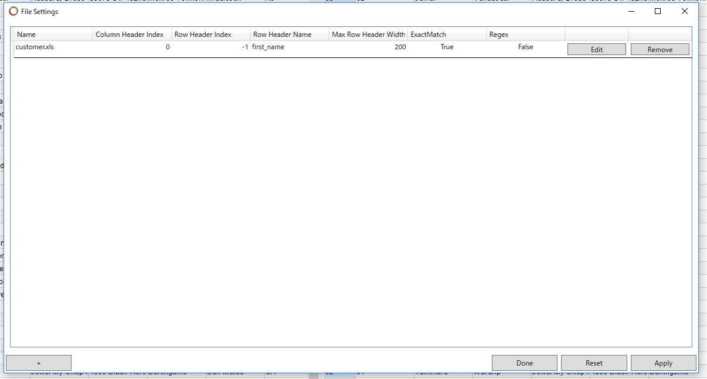
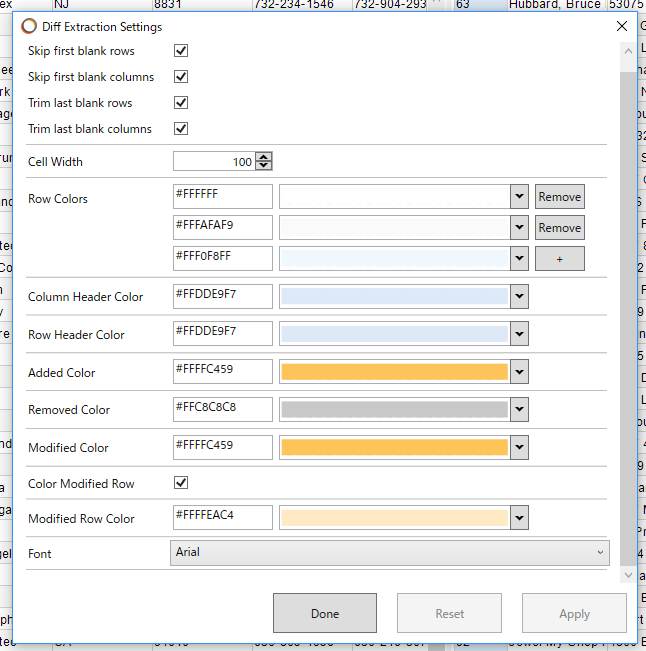
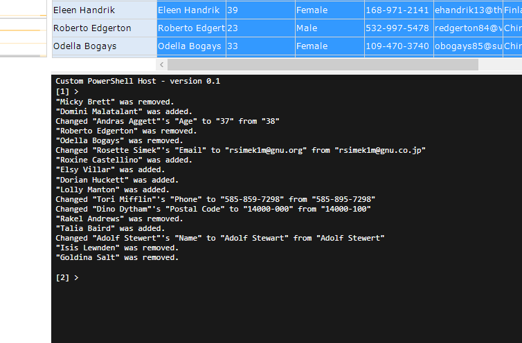

- [中文](https://github.com/kailoke/ExcelDiff/blob/master/README.md)
- [English](https://github.com/kailoke/ExcelDiff/blob/master/README.en)


# ExcelDiff

Windows 桌面 GUI 差异对比工具（Excel / CSV / TSV），可作 Git / Mercurial difftool。
同一份源码编译出两套产品：

- **EME**（优先/基准版，`ExcelDiffEDR.GUI.exe`）：ExcelDataReader 读取。读取效率高（基准测试约 1.8MB 文件读取耗时约为 EM 的 28%，提升约 72%），开发与基准测试以 EME 为准。
- **EM**（保底版，`ExcelDiff.GUI.exe`）：NPOI 读取。语义最全，作为 EDR 盲区兜底与验证对照。

两版进程 / 程序集 / 配置 / 显示名全隔离，互不干扰。界面默认简体中文，支持中/英切换。





## 功能特性

- 差异对比：行级 + 单元格级高亮（`xls` / `xlsx` / `csv` / `tsv`）。
- 常驻 + 托盘：单实例驻留后台，隐藏/恢复/退出。
- 单实例 IPC：二次调用经命名管道路由给常驻实例，避免多开。
- 无差异通知窗口：两文件相同时按需弹窗提示（`NotifyEqual`）。
- 窗口持久化：位置/尺寸/列宽/行高/字体/搜索历史自动保存。
- 外置本地化：`lang\en-US.json` / `lang\zh-CN.json`（UTF-8）。
- 外部命令 / 文件设置 / 颜色设置 / 差异日志输出。
- 开机自启（`StartOnBoot`）。

## 系统要求

- Windows 7 或更高版本
- .NET Framework 4.6.2

## 支持的文件类型

- `.xls`
- `.xlsx`
- `.csv`
- `.tsv`

## 构建与部署

本机使用 `dotnet msbuild`（无独立 MSBuild），需指定参考程序集根目录。

### EME（优先/基准版，EDR 读取）— 产物 `ExcelDiffEDR.GUI.exe`

```
dotnet msbuild ExcelDiff.GUI/ExcelDiff.GUI.csproj /p:Configuration=Release /p:EdrRead=true /p:TargetFrameworkRootPath="D:\ExcelDiff\packages\refs" /p:IncludePackageReferencesDuringMarkupCompilation=false /p:GenerateResourceMSBuildArchitecture=CurrentArchitecture /p:GenerateResourceMSBuildRuntime=CurrentRuntime /t:Build /v:m /nologo
```

### EM（保底版，NPOI 读取）— 产物 `ExcelDiff.GUI.exe`

同上，去掉 `/p:EdrRead=true`（默认）。

### 部署次序与常驻进程重启

1. 构建 EME → 部署 EME。
2. 构建 EM → 部署 EM。
3. **每次部署后立即重启对应常驻进程**（杀进程 → 从部署路径以 `--startup` 拉起）。

原因：常驻进程从部署目录启动并锁住 exe，不杀进程无法覆盖部署，且旧进程仍在内存运行，测试结果失真。注意：不能在同一条命令里连续构建两个变体（增量构建会互删输出），必须分步。

### 一键验证门禁

```
powershell -ExecutionPolicy Bypass -File verify.ps1
```

全绿 = 双版编译通过 + NetDiff 31 用例通过 + lang↔resx 同步。

## 使用方式

### 从快捷方式


### 命令行

```
ExcelDiff.GUI diff [Options]
```

| Option | Description | Type | Default |
|--------|-------------|------|---------|
| `-s` `--src-path` | Source file path. | string | |
| `-d` `--dst-path` | Dest file path. | string | |
| `-c` `--external-cmd` | 用于不支持的文件类型或发生异常时激活外部工具。 | string | |
| `-i` `--immediately-execute-external-cmd` | 直接执行外部命令，不弹错误对话框。 | bool | false |
| `-w` `--wait-external-cmd` | 等待外部进程结束。 | bool | false |
| `-v` `--validate-extension` | 打开前校验扩展名。 | bool | false |
| `-e` `--empty-file-name` | 空文件名称。 | string | |
| `-k` `--keep-file-history` | 不记录最近文件。 | bool | false |

> 单实例 IPC：若已有常驻实例在运行，新的命令行调用会通过命名管道转发给常驻实例处理，随后立即退出。常驻实例启动参数含 `--startup` 时隐藏运行。

### Git difftool

`.gitconfig`

```
[diff]
tool = ExcelDiff

[difftool "ExcelDiff"]
cmd = \"D:/Program Files/ExcelDiff/ExcelDiff.GUI.exe\" diff -s \"$LOCAL\" -d \"$REMOTE\" -c WinMerge -i -w -v -k

[alias]
windiff = difftool -g -y -t ExcelDiff
```

### Mercurial difftool

`mercurial.ini`

```
[merge-tools]
exceldiff.executable = D:\Program Files\ExcelDiff\ExcelDiff.GUI.exe
exceldiff.diffargs = diff -s $parent1 -d $child -c WinMerge -i -w -v -e empty -k

[tortoisehg]
vdiff = exceldiff
```

> 路径请按实际部署目录调整；基准对比以 EME 为准，EM 作保底验证对照。

### 资源管理器右键菜单

安装 `ExcelDiff.ShellExtension`（COM 外壳扩展）后，从资源管理器右键菜单直接对比。


## 外部命令注册

通过命令行参数 `--external-cmd` 指定外部命令。



### 可用变量

| Value | Description |
|-------|-------------|
| `${SRC}` | Source file path |
| `${DST}` | Dest file path |

也可在工具内执行。



## 文件设置 / 颜色设置

- 文件设置：为每个文件指定行头或列头。
- 颜色设置：自定义背景色（交替行 / 列头 / 行头 / 新增 / 删除 / 修改 / 修改行）。





## 快捷键

| Shortcut Key | Description |
|--------------|-------------|
| Ctrl + → | Next modified cell |
| Ctrl + ← | Previous modified cell |
| Ctrl + ↓ | Next modified row |
| Ctrl + ↑ | Previous modified row |
| Ctrl + K | Next added row |
| Ctrl + I | Previous added row |
| Ctrl + L | Next removed row |
| Ctrl + O | Previous removed row |
| Ctrl + F | Search cell |
| F9 | Next match cell |
| F8 | Previous match cell |
| Ctrl + C | Copy selected cells as TSV |
| Ctrl + Shift + C | Copy selected cells as CSV |
| Ctrl + D | Show(Hide) console |
| Ctrl + B | Output selected cells diff as log |

## 差异日志输出

按 `Ctrl + D` 或从右键菜单选择 "Output log"，可将差异输出为日志。
格式可在"差异提取设置"中修改。



## 无差异窗口与语言切换

- **无差异窗口**：两文件无差异且 `NotifyEqual` 开启时弹出。关闭 = 点右上角"✕"或按 ESC（仅关弹窗）；红色"退出"按钮（回车触发）会连对比窗口一起关闭。
- **语言切换**：在设置中切换语言后，应用将关闭以变更语言；下次 diff 命令以新语言重建窗口。

## 设置与持久化

设置以 YAML 保存于：

```
%APPDATA%\<程序集名>\<程序集名>.yml
```

- EME：`%APPDATA%\ExcelDiffEDR.GUI\`
- EM：`%APPDATA%\ExcelDiff.GUI\`

## 回归验证

- `verify.ps1`：一键门禁（双版编译 + NetDiff 31 用例 + lang↔resx 同步）。
- `DiffHarness\`：headless diff 对比（EM/EME 输出确定性 diff 文本）。
- `NetDiff\NetDiff.TestRunner\`：离线算法单测 runner。

## Known problems

- 若出现列删除或添加，可能不会显示在预期位置。可指定合适的表头并重新提取差异解决：
  1. 选中合适的表头单元格。
  2. 右键显示上下文菜单。
  3. 选择"以该行作为表头提取差异"。

## LICENSE

#### MIT License

Copyright (c)2017 skanmera

Permission is hereby granted, free of charge, to any person obtaining a copy of this software and associated documentation files (the "Software"), to deal in the Software without restriction, including without limitation the rights to use, copy, modify, merge, publish, distribute, sublicense, and/or sell copies of the Software, and to permit persons to whom the Software is furnished to do so, subject to the following conditions:

The above copyright notice and this permission notice shall be included in all copies or substantial portions of the Software.

THE SOFTWARE IS PROVIDED "AS IS", WITHOUT WARRANTY OF ANY KIND, EXPRESS OR IMPLIED, INCLUDING BUT NOT LIMITED TO THE WARRANTIES OF MERCHANTABILITY, FITNESS FOR A PARTICULAR PURPOSE AND NONINFRINGEMENT. IN NO EVENT SHALL THE AUTHORS OR COPYRIGHT HOLDERS BE LIABLE FOR ANY CLAIM, DAMAGES OR OTHER LIABILITY, WHETHER IN AN ACTION OF CONTRACT, TORT OR OTHERWISE, ARISING FROM, OUT OF OR IN CONNECTION WITH THE SOFTWARE OR THE USE OR OTHER DEALINGS IN THE SOFTWARE.
