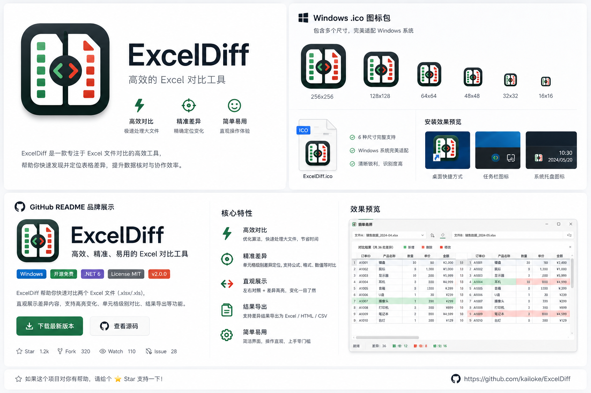
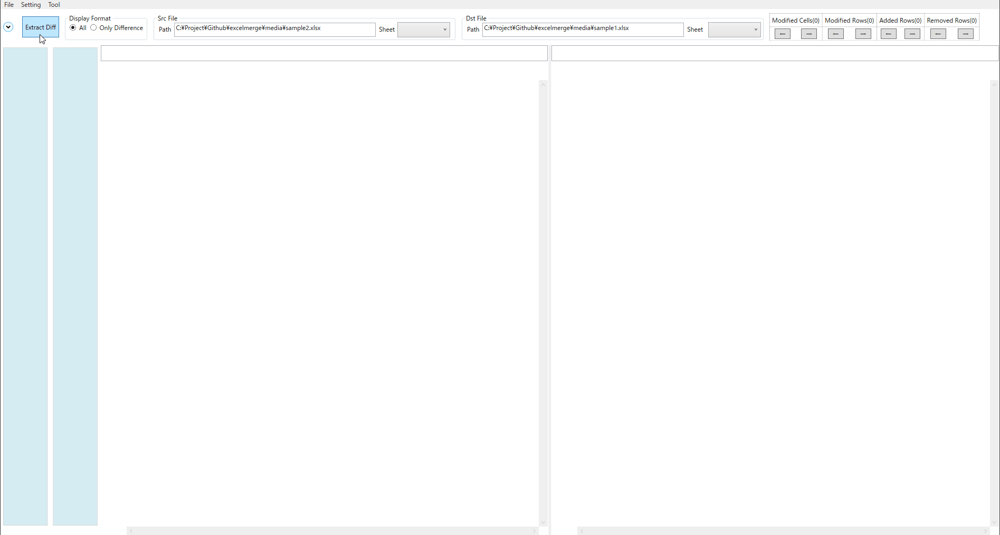
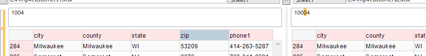
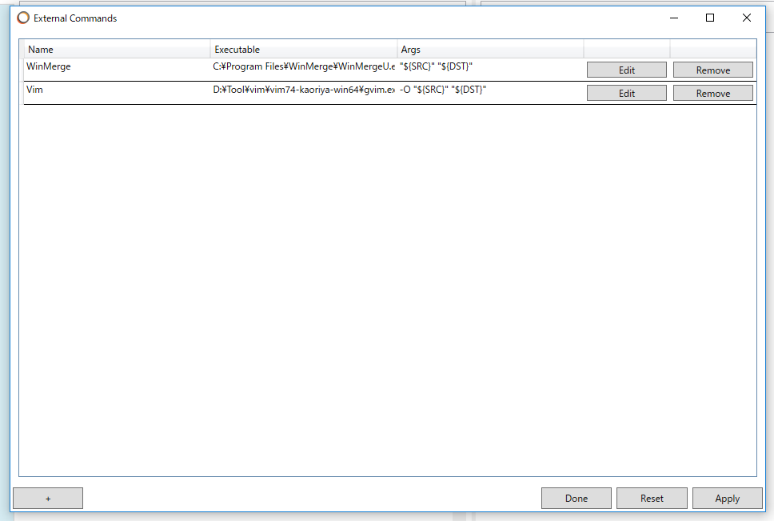
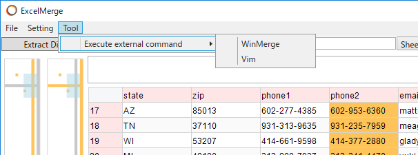
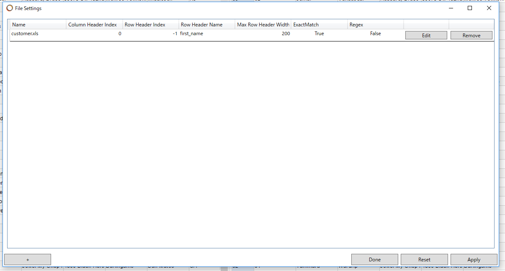
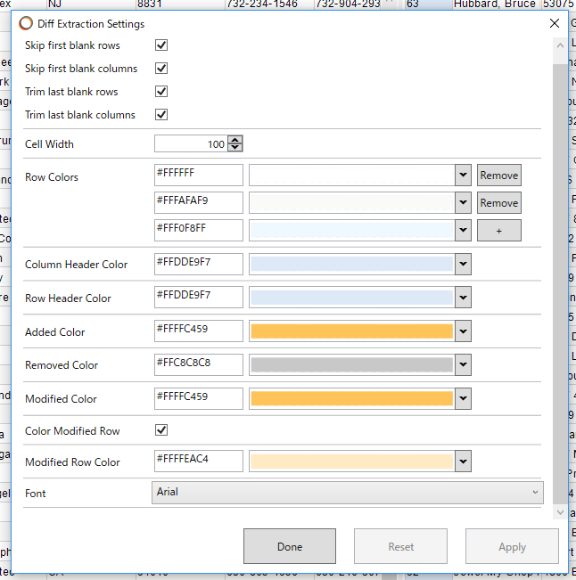
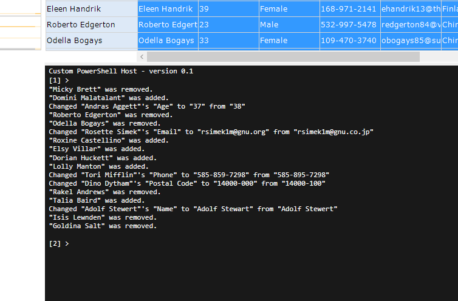

- [中文](https://github.com/kailoke/ExcelDiff/blob/master/README.md)
- [English](https://github.com/kailoke/ExcelDiff/blob/master/README.en)



# ExcelDiff

Windows 桌面 GUI 差异对比工具（Excel / CSV / TSV），可作 Git / Mercurial difftool。
同一份源码编译出两套产品（EDR 为主版本，EDN 保留保底对照）：

- **EDR**（主版本，`ExcelDiffEDR.GUI.exe`）：ExcelDataReader 读取。读取效率高（基准测试约 1.8MB 文件读取耗时约为 EDN 的 28%，提升约 72%），日常构建 / 部署 / 门禁均以 EDR 为准。
- **EDN**（保底版，`ExcelDiff.GUI.exe`）：NPOI 读取。语义最全，代码保留作为 EDR 盲区兜底与验证对照，不参与日常构建 / 部署。

两版进程 / 程序集 / 配置 / 显示名全隔离，互不干扰。界面语言支持中/英：默认取安装向导里选的语言（写入注册表供程序读取），没选过则按系统显示语言判定，之后在设置里手动切换优先。





## 功能特性

- 差异对比：行级 + 单元格级高亮（`xls` / `xlsx` / `csv` / `tsv`）。
- 常驻 + 托盘：单实例驻留后台，隐藏/恢复/退出。
- 单实例 IPC：二次调用经命名管道路由给常驻实例，避免多开。
- 无差异通知窗口：两文件相同时按需弹窗提示（`NotifyEqual`）。
- 窗口持久化：位置/尺寸/列宽/行高/字体/搜索历史自动保存。
- 外置本地化：`lang\en-US.json` / `lang\zh-CN.json`（UTF-8）。
- 外部命令 / 文件设置 / 颜色设置 / 差异日志输出。
- 开机自启（`StartOnBoot`）。

## 系统要求

- Windows 7 SP1 或更高版本
- .NET Framework 4.7.2

## 安装与卸载

### 安装

运行发布出去的 `ExcelDiffSetup-<版本>.exe`（需要管理员权限），向导共 5 页：**语言**（默认按系统显示语言；点选后整个向导立即换语言）→ **位置与组件** → 确认 → 进度 → 完成。

- 默认安装目录 `%ProgramFiles%\ExcelDiffEDRTool`，可改；下次安装会沿用上次的位置。
- 组件默认勾选：桌面快捷方式 ✓ / 开机自启 ✓ / **资源管理器右键菜单 ✗**（要用请在这一页勾上）。
- 静默安装：`ExcelDiffSetup-<版本>.exe /silent /dir="D:\Tools\ExcelDiffEDRTool" /components:shell,desktop,autostart /culture:zh-CN`。
  开关：`/silent|/quiet`、`/uninstall`、`/install`、`/culture:zh-CN|en-US`、`/dir=<绝对路径>`（相对路径与盘符根会被拒绝）、`/components:shell,desktop,autostart|none|all`、`/clearsettings`、`/log:<路径>`、`/?`。
  退出码：`0` 成功 / `1` 失败 / `2` 显示帮助 / `3` 载荷缺失 / `4` 命令行非法 / `130` 用户取消。**唯一例外**：从安装目录内的 `Uninstall.exe` 发起的卸载返回 0 只代表"已移交"（真正执行的是它复制到临时目录的那份），成不成看目录与"应用和功能"里的条目是否消失。

安装完成后，安装目录里会留下一份与安装包同内容的 **`Uninstall.exe`**。

### 卸载

任选其一：

1. **设置 → 应用 → ExcelDiffEDR → 卸载**（或控制面板"程序和功能"）——会打开卸载向导：先选语言，再确认，可以选择是否同时删除当前用户的设置。
2. **双击安装目录里的 `Uninstall.exe`** —— 同样打开卸载向导（默认动作就是卸载，不是重装）。
3. **命令行**：`Uninstall.exe /uninstall /silent`（静默；加 `/clearsettings` 才连当前用户的设置目录一起删）。

- **用户配置默认保留**：`%APPDATA%\ExcelDiffEDR.GUI\` 只有在向导里勾上"同时删除…"或传 `/clearsettings` 时才会被删除。
- 卸载按安装时写下的 `install-manifest.txt` 逐项删除，只删自己放下去的文件与空目录；**清单缺失时直接拒绝卸载**，不会去猜目录内容。
- 若提示有文件被占用（通常是资源管理器持着右键菜单扩展）：重启资源管理器或注销后再卸一次即可清干净。
- 想改组件（例如补上右键菜单）：重新下载安装包运行并勾选对应项（重装=先卸后装，带失败回滚）。安装目录里的那份副本默认动作是卸载，要拿它重装得显式加 `/install`。

## 支持的文件类型

- `.xls`
- `.xlsx`
- `.csv`
- `.tsv`

## 构建与部署

本机使用 `dotnet msbuild`（无独立 MSBuild），需指定参考程序集根目录；下文 `<repo>` 表示仓库根目录的绝对路径（`git rev-parse --show-toplevel`）。

### EDR（主版本，ExcelDataReader 读取）— 产物 `ExcelDiffEDR.GUI.exe`

```
dotnet msbuild ExcelDiff.GUI/ExcelDiff.GUI.csproj /p:Configuration=Release /p:EdrRead=true /p:FrameworkPathOverride="<repo>\packages\refs\.NETFramework\v4.7.2" /p:IncludePackageReferencesDuringMarkupCompilation=false /p:GenerateResourceMSBuildArchitecture=CurrentArchitecture /p:GenerateResourceMSBuildRuntime=CurrentRuntime /t:Build /v:m /nologo
```

### EDN（保底版，NPOI 读取，代码保留 / 不日常构建）— 产物 `ExcelDiff.GUI.exe`

同上，去掉 `/p:EdrRead=true`（默认）。仅在需要 EDN 保底对照时手工构建。

### 部署次序与常驻进程重启

1. 构建 EDR → 部署 EDR。
2. **每次部署后立即重启 EDR 常驻进程**（杀进程 → 从部署路径以 `--startup` 拉起）。

原因：常驻进程从部署目录启动并锁住 exe，不杀进程无法覆盖部署，且旧进程仍在内存运行，测试结果失真。EDN（NPOI）保底代码保留但不参与日常构建 / 部署。

### 一键验证门禁

```
powershell -ExecutionPolicy Bypass -File AI_Script\verify.ps1
```

全绿 = EDR 主版本编译通过 + 安装器工程编译通过 + NetDiff 31 用例通过 + `lang\*.json ↔ resx` 双向同步 + 两份 resx 键集一致 + 坑扫描（禁止对转发进程 `Start-Process -Wait`、XAML 内禁止硬编码可见文本）。

安装包另有发布门禁：`powershell -ExecutionPolicy Bypass -File AI_Script\verify-installer.ps1 -Install`（静态检查载荷/资源/版本/双语键集，外加 A–M 十三个**真实**安装·卸载·重装·回滚·拒绝用例；需要管理员，机器上已有安装记录时会拒绝运行，跑完自动还原 `HKCU Run` 与用户设置目录）。

## 使用方式

### 从快捷方式


### 命令行

```
ExcelDiffEDR.GUI.exe [diff] <左文件> <右文件>
ExcelDiffEDR.GUI.exe [diff] -s <左文件> -d <右文件> [-c <工具>] [-i] [-w] [-v] [-e <文件名>]
```

- 左表 = 源文件（`-s`），右表 = 目标文件（`-d`）。位置参数按书写顺序依次填入这两个槽位，最多两个。
- 命令词 `diff` 可省略。首参等于 `diff` / `none` / `merge` 时按命令词处理（`merge` 尚未实现，会提示 unknown command），否则按文件路径处理。
- 位置参数与显式 `-s` / `-d` 不混用。参数不合法（多于两个位置参数、混用、空参数、值选项缺值）时弹 `Invalid argument.`。
- 路径含空格必须加引号。

| 选项 | 描述 | 类型 | 默认值 |
|------|------|------|--------|
| `-s` `--src-path` | 源文件路径。 | string | |
| `-d` `--dst-path` | 目标文件路径。 | string | |
| `-c` `--external-cmd` | 用于不支持的文件类型或发生异常时激活外部工具。 | string | |
| `-i` `--immediately-execute-external-cmd` | 直接执行外部命令，不弹错误对话框。 | bool | false |
| `-w` `--wait-external-cmd` | 等待外部进程结束。 | bool | false |
| `-v` `--validate-extension` | 打开前校验扩展名。 | bool | false |
| `-e` `--empty-file-name` | 空文件名称。 | string | |

> 单实例 IPC：若已有常驻实例在运行，新的命令行调用会通过命名管道转发给常驻实例处理，随后立即退出。常驻实例启动参数含 `--startup` 时隐藏运行。

### Git difftool

`.gitconfig`（`<安装目录>` = 实际安装位置：安装程序默认 `%ProgramFiles%\ExcelDiffEDRTool`，可在向导里改目录，或用**下载的安装包**（`ExcelDiffSetup-<版本>.exe`）加 `/dir=<绝对路径>` 指定 —— 安装目录里那份 `Uninstall.exe` 只用于卸载；EDR 主版本 exe 为 `ExcelDiffEDR.GUI.exe`，EDN 为 `ExcelDiff.GUI.exe`）

```
[diff]
tool = ExcelDiff

[difftool "ExcelDiff"]
cmd = \"<安装目录>/ExcelDiffEDR.GUI.exe\" diff -s \"$LOCAL\" -d \"$REMOTE\" -c WinMerge -i -w -v

[alias]
windiff = difftool -g -y -t ExcelDiff
```

### Fork 外部对比工具

Fork → Settings → External Diff Tools → Add：

| 字段 | 值 |
|------|----|
| Name | `EDR`（任意名字） |
| Path | `<安装目录>\ExcelDiffEDR.GUI.exe` |
| Arguments | `"$REMOTE" "$LOCAL"` |

- **第一个占位符 = 左表、第二个 = 右表**（位置参数依次填入 `-s` / `-d`），所以"左边显示远端、右边显示本地"就写 `"$REMOTE" "$LOCAL"`；想显式写出来是 `diff -s "$REMOTE" -d "$LOCAL"`。决定左右的是 `-s` / `-d` 后面的值，不是两个选项的书写顺序。
- `$LOCAL` / `$REMOTE` 是 Fork 传出的两个临时文件占位符。**引号必须保留**（临时文件目录可能含空格）。配好后点一次对比，看窗口顶部"源文件 / 目标文件"两个路径框即可确认左右。
- 可选参数：`-v` 打开前校验扩展名、`-c <工具> -i` 让不支持的类型直接转交外部工具而不弹错误框。
- **常驻与"等待外部工具"**：ExcelDiff 是托盘常驻设计（进程不会因窗口关闭而退出）。若调用时没有常驻实例，被启动的那个进程会自己变成常驻且**不退出**，Fork 那边就一直显示在等外部工具。先把常驻启动起来（`ExcelDiffEDR.GUI.exe --startup`），之后每次对比都是"转发给常驻后立刻退出"。常驻的完整性级别要与桌面一致：不同级时 Fork 通过命名管道连不上（UIPI 拦截）。注意"一致"不等于"必须普通权限"——UAC 被关闭的机器上 explorer / Fork / 应用本来就全是 High。

### Mercurial difftool

`mercurial.ini`

```
[merge-tools]
exceldiff.executable = <安装目录>\ExcelDiffEDR.GUI.exe
exceldiff.diffargs = diff -s $parent1 -d $child -c WinMerge -i -w -v -e empty

[tortoisehg]
vdiff = exceldiff
```

> 路径请按实际部署目录调整；基准对比以 EDR 为准，EDN 作保底验证对照。

### 资源管理器右键菜单

`ExcelDiff.ShellExtension` 是 COM 外壳扩展：**安装向导第 2 页默认不勾**，要资源管理器里右键单个文件 → `ExcelDiffEDR` 就在该页勾上"添加资源管理器右键菜单"（勾了之后无需重启资源管理器，安装过程会通知外壳刷新；若在卸载/重装过程中注册失败，则重启资源管理器一次）。已装好后再补：重新下载安装包运行并勾上该项（勾选框按**本次命令行**的 `/components:` 预填，没给开关时才是出厂默认 桌面 ✓ / 自启 ✓ / 右键菜单 ✗；两种情况都**不**按当前注册状态预填，所以只勾你要加的那一项）。


## 外部命令注册

通过命令行参数 `--external-cmd` 指定外部命令。



### 可用变量

| 值 | 描述 |
|-------|-------------|
| `${SRC}` | 源文件路径 |
| `${DST}` | 目标文件路径 |

也可在工具内执行。



## 文件设置 / 颜色设置

- 文件设置：为每个文件指定行头或列头。
- 颜色设置：自定义背景色（交替行 / 列头 / 行头 / 新增 / 删除 / 修改 / 修改行）。





## 快捷键

| 快捷键 | 描述 |
|---------|------|
| Ctrl + → | 下一个修改的单元格 |
| Ctrl + ← | 上一个修改的单元格 |
| Ctrl + ↓ | 下一个修改的行 |
| Ctrl + ↑ | 上一个修改的行 |
| Ctrl + K | 下一个新增行 |
| Ctrl + I | 上一个新增行 |
| Ctrl + L | 下一个删除行 |
| Ctrl + O | 上一个删除行 |
| Ctrl + F | 搜索单元格 |
| F9 | 下一个匹配单元格 |
| F8 | 上一个匹配单元格 |
| Ctrl + C | 复制选中单元格为 TSV |
| Ctrl + Shift + C | 复制选中单元格为 CSV |
| Ctrl + D | 显示(隐藏)控制台 |
| Ctrl + B | 将选中单元格差异输出为日志 |

## 差异日志输出

按 `Ctrl + D` 或从右键菜单选择 "Output log"，可将差异输出为日志。
格式可在"差异提取设置"中修改。



## 无差异窗口与语言切换

- **无差异窗口**：两文件无差异且 `NotifyEqual` 开启时弹出。关闭 = 点右上角"✕"或按 ESC（仅关弹窗）；红色"退出"按钮（回车触发）会连对比窗口一起关闭。
- **语言切换**：在设置中切换语言后，应用将关闭以变更语言；下次 diff 命令以新语言重建窗口。

## 设置与持久化

设置以 YAML 保存于：

```
%APPDATA%\<程序集名>\<程序集名>.yml
```

- EDR：`%APPDATA%\ExcelDiffEDR.GUI\`
- EDN：`%APPDATA%\ExcelDiff.GUI\`

## 回归验证

- `AI_Script\verify.ps1`：一键门禁（EDR 主版本编译 + 安装器工程编译 + NetDiff 31 用例 + lang↔resx 双向同步 + 两份 resx 键集一致 + 坑扫描）。
- `AI_Script\verify-installer.ps1`：安装包发布门禁（静态检查；`-Install` 追加 A–M 十三个真实安装/卸载/重装/回滚/拒绝用例，需管理员）。
- `DiffHarness\`：headless diff 对比（EDN/EDR 输出确定性 diff 文本）。
- `NetDiff\NetDiff.TestRunner\`：离线算法单测 runner。

## Known problems

- 若出现列删除或添加，可能不会显示在预期位置。可指定合适的表头并重新提取差异解决：
  1. 选中合适的表头单元格。
  2. 右键显示上下文菜单。
  3. 选择"以该行作为表头提取差异"。

## LICENSE

#### MIT License

Copyright (c)2017 skanmera
Copyright (c)2026 Kailoke

Permission is hereby granted, free of charge, to any person obtaining a copy of this software and associated documentation files (the "Software"), to deal in the Software without restriction, including without limitation the rights to use, copy, modify, merge, publish, distribute, sublicense, and/or sell copies of the Software, and to permit persons to whom the Software is furnished to do so, subject to the following conditions:

The above copyright notice and this permission notice shall be included in all copies or substantial portions of the Software.

THE SOFTWARE IS PROVIDED "AS IS", WITHOUT WARRANTY OF ANY KIND, EXPRESS OR IMPLIED, INCLUDING BUT NOT LIMITED TO THE WARRANTIES OF MERCHANTABILITY, FITNESS FOR A PARTICULAR PURPOSE AND NONINFRINGEMENT. IN NO EVENT SHALL THE AUTHORS OR COPYRIGHT HOLDERS BE LIABLE FOR ANY CLAIM, DAMAGES OR OTHER LIABILITY, WHETHER IN AN ACTION OF CONTRACT, TORT OR OTHERWISE, ARISING FROM, OUT OF OR IN CONNECTION WITH THE SOFTWARE OR THE USE OR OTHER DEALINGS IN THE SOFTWARE.
